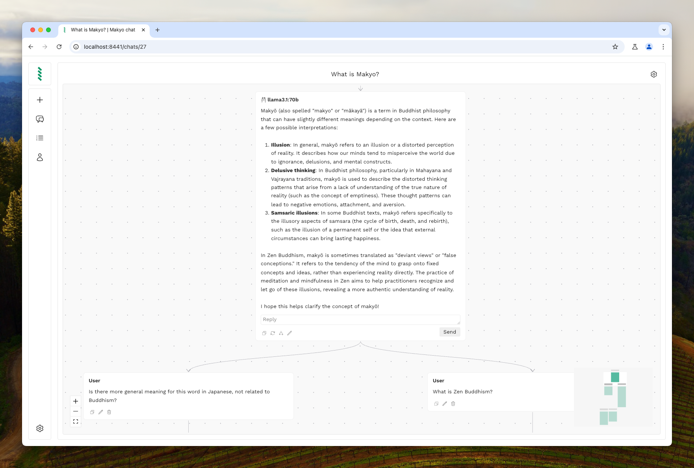

Makyo is a modern node-based frontend for LLMs. It's made with Bun, Hono, and React.

Features:
* Node-based UI allows for easy and convenient branching of conversation with LLM.
* Use quick replies to ask LLM common questions about selected text.
* Create personas with preset system message and/or temperature.
* Use snippets to save and quickly paste saved prompts.
* Makyo uses OpenRouter for managed LLMs, which means it's easy to add new providers.
* For local LLMs, Makyo expects you to have Ollama.
* Makyo can proxy requests to Ollama through browser. This means that you can chat with models installed on your laptop from your phone and have history available for all devices.




## Roadmap

I work on Makyo in my spare time and only when I feel like it. And so there are no estimates when particular feature will be implemented. But loosely I have this vision for Makyo:

- Support multimodal LLMs, starting with vision.
- Add long term memory. `@remember` or something to add fact to LLM memory.
- RAG
    - Ability to create ‘folders’ and upload documents there.
    - Ability to share folder with a persona or in specific chat.
    - Use RAG to answer questions related to the documents.
- Tools / functions calling (e.g. search in Google, load web page).
- Autocomplete for snippets when user types `/` or `@`.
- Models management UI for Ollama: pull and create from Modelfile.
- Companion browser extension (e.g. create chat based on web page/selected text).

## Deploy

Easiest way to deploy is Docker. Currently, there is no pre-built images, but building one from sources is easy.

Copy file `.env.example` and rename it to just `.env`. Edit the file and put password and other settings for services you intend to use.

If you decide to use local Ollama proxy, you need to add domain where Makyo will be deployed to `OLLAMA_ORIGINS` variable. [How to set variables for Ollama](https://github.com/ollama/ollama/blob/main/docs/faq.md#how-do-i-configure-ollama-server).

And then run container with docker compose (might require using sudo, depending on Docker setup):

```bash
# -d to run in background
# add --build to build container after pulling newer version
docker-compose up -d
```

**Note:** if hosting behind nginx (or other reverse proxy), make sure to increase `proxy_read_timeout` (or equivalent for your proxy) to allow for SSE and WebSockets to work properly.

## Reporting bugs, proposing features, and other contributions

This is a project I do for myself and mostly because it's just fun, I love programming. I'm making this public and open-source in case there are people who might find it useful.

But with that being said, I run my projects as I find comfortable. So, feel free to report a bug or a feature, but there is a very slim chance I will fix/add it, unless it's a critical bug or really cool feature that I'll use myself. If you want to contribute code, please open an issue first, describing what you plan to do (unless it's like a really small PR, send those right away). Or else you risk your PR not being merged, and I don't really want you to waste your time.


## Local development

**Due to usage of pre-compiled SQLite extensions, local development only supported for Mac OS on ARM and Linux (ARM/x64).**

We use unicode SQLite extension from [nalgeon/sqlean](https://github.com/nalgeon/sqlean).

On Mac, you'll need to install SQLite from Homberwer:

```bash
brew install sqlite
```

If you want to use OpenAI/Anthropic provider, copy `.env.development` and rename it to `.env.local` and put your key there.

Then to run app locally without docker, first install dependencies:

```bash
bun install
```

Setup database:

```bash
bun run drizzle:migrate
# Optionally seed database with default personas/snippets
bun run drizzle:seed
```

Run dev server and frontend:

```bash
bun run server
bun run client
```

* Backend available on [localhost:8440](http://localhost:8440)
* Frontend available on [localhost:8441](http://localhost:8441)

To generate migration after DB schema change:

```bash
bun run drizzle:schema
```

There is a template to easily create new components and routes:

```bash
bun scaffold component new Button
bun scaffold route new DetailsPage
```

## Support development / say thanks

> [!TIP]
> If you found this plugin useful and wanted to say thanks with a coin, you can do so [here](https://sinja.io/support).
